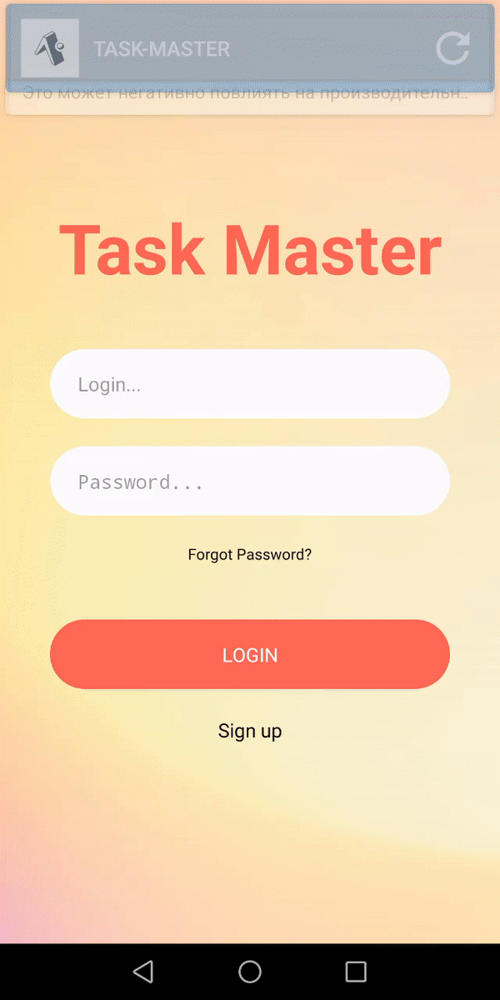
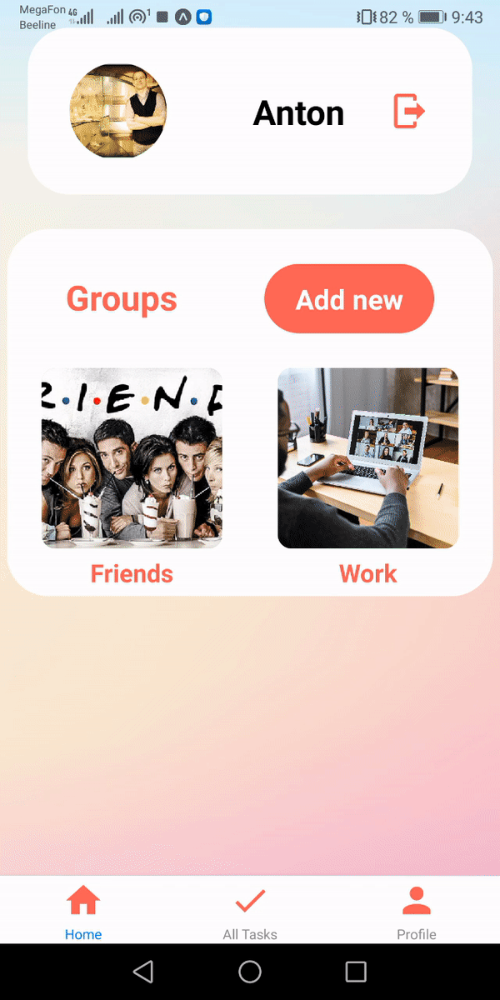
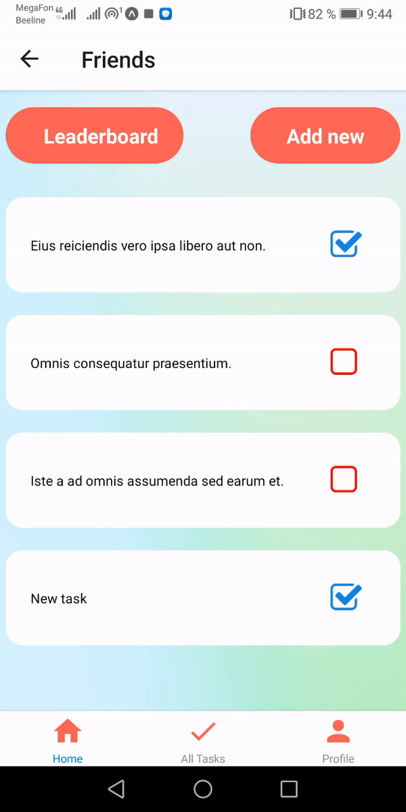

# taskMaster

<b> Task Master: Развлекательное приложение под iOS и Android. Приложение для общения с друзьями и коллегами, обмена фотографиями выполненных заданий, просмотра выполненных заданий друзей, подсчёта рейтинга, обмена лайками.
  </b>  
  
 <b>
Techs: HTML, CSS, JavaScript, Express.js, Node.js, MongoDB, React Native, Redux.
 </b>
 
 <b>
Команда
</b>

https://github.com/MuckHub

https://github.com/KetiRudneva

https://github.com/antonsipin

Android
  </b>
  

  
  
  
  
  
  
  

<b>
iOS
</b>

  
  
  
  
  

<b>

